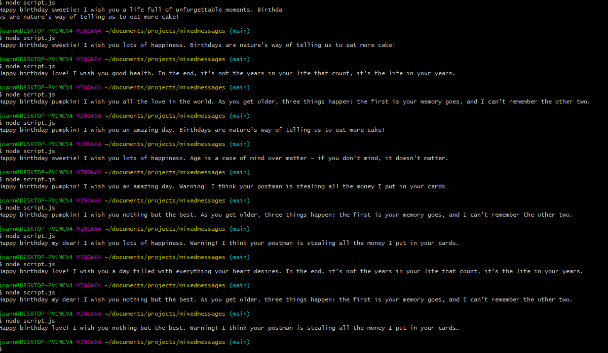

# Project Name :books:
----------
 > ##### *Mixed Messages*

## Table of Contents :open_file_folder:
* [General Info](#general-information)
* [Technologies Used](#technologies-used)
* [Screenshot](#screenshot)
* [Contact](#contact)

## General Information 
*A message generator program using JavaScript. Every time you run the program, you should get a new, randomized birthday message.* :cake: :gift:

## Technologies Used 
- JavaScript
- Git and GitHub
- VS Code
- Node.js

## Screenshot

## Contact :e-mail:
> Created by @ioanagh27 

